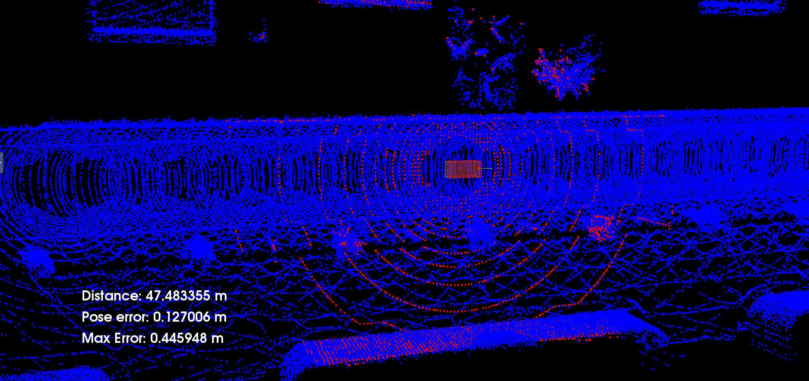
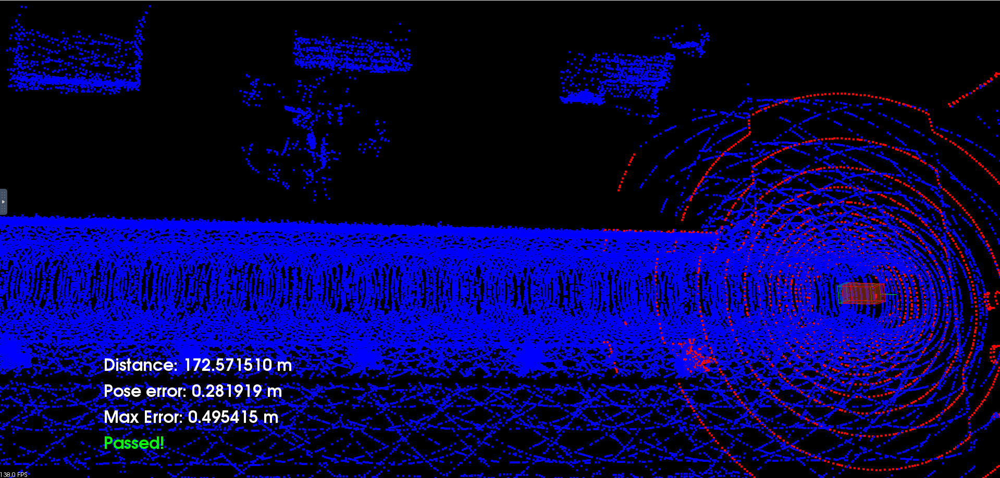

# Scan Matching Localization

The following 
project implements ICP to localize a vehicle throughout a given map.

The localization is based on LiDAR measurements as shown below:



The goal of the project is to localize the vehicle continuesly during 170 meters without getting a max error higher than 1.2 [m]. The speed must be an intermedium velocity which means 3 up arrows in our CARLA interface.

The final result is shown below:




## Dependencies
* vtk7.1
* pcl-1.10.1
* carla simulator 0.9.10
* cmake

### tree main files

.
├── CMakeLists.txt
├── README.md
├── c3-main.cpp
├── helper.cpp
├── helper.h
├── libcarla-install/
├── make-libcarla-install.sh
├── map.pcd
├── map_loop.pcd
├── rpclib
└── run_carla.sh

### libcarla-install
Ensure that the libcarla-install/ folder is present in your current working directory. The folder contains the static binaries built for the target VM workspace environment. If the folder is missing or corrupt, you can regenerate the files using the following command:

```
chmod +x make-libcarla-install.sh
./make-libcarla-install.sh
```
